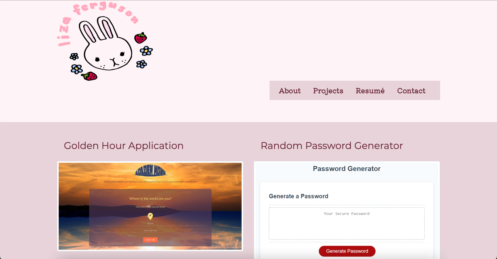

# Portfolio
This webpage is a personal portfolio to be shown to potential employers to showcase projects I have completed and development skills. The portfolio includes sections about me, completed projects, a resume, and contact information.

## Installation
To access codebase,
  * Go to https://github.com/lizaferguson/Portfolio
  * Click Code
  * Click Download Zip or Clone onto local device by copying the link https://github.com/lizaferguson/Portfolio.git into gitbash/terminal
  * Open files in preferred text editor or web browser

To access deployed webpage,
* Visit the url https://lizaferguson.github.io/Portfolio/

## Usage
This webpage is to provide personal and professional information. This is what the webpage should looklike upon loading. Click on the links in the navigation bar to be redirected to different pages.

## Credits
Consulted code from https://www.w3schools.com/default.asp
